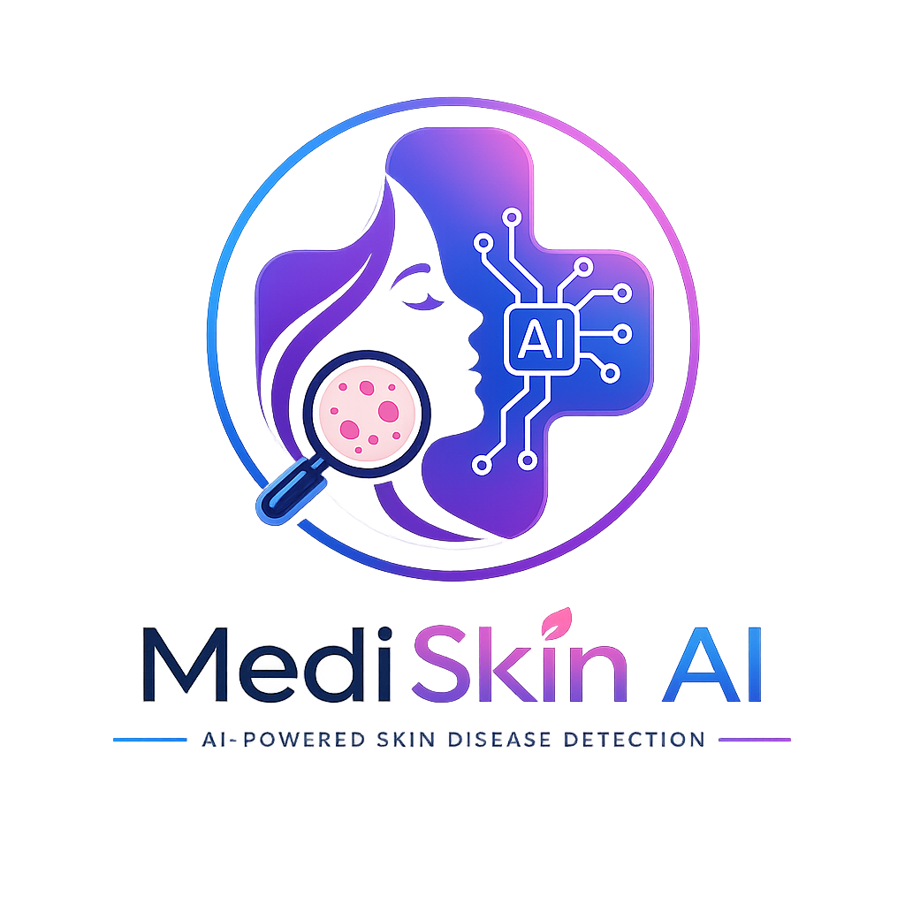

<div align="center">



# 🩺 MediSkin AI

### AI-Powered Skin Disease Diagnosis Platform

[](https://sree8639-mediskin-ai.hf.space)
[](https://python.org)
[](https://djangoproject.com)
[](https://tensorflow.org)
[](https://docker.com)
[](LICENSE)

*Upload a skin image → Get an instant AI diagnosis → Download your PDF report*

### 🌐 Live URL
**https://sree8639-mediskin-ai.hf.space**

</div>

---

## 🌐 Live Demo

> **Deployed on Hugging Face Spaces (Docker)**
>
> 👉 **[https://sree8639-mediskin-ai.hf.space](https://sree8639-mediskin-ai.hf.space)**

| Page | URL |
|---|---|
| 🏠 Home | https://sree8639-mediskin-ai.hf.space/ |
| 🔬 Diagnostics | https://sree8639-mediskin-ai.hf.space/diagnostics/ |
| 👤 Profile | https://sree8639-mediskin-ai.hf.space/profile/ |
| 📄 Report Preview | https://sree8639-mediskin-ai.hf.space/pdf-demo/ |

> **Demo credentials** — Username: `demo` · Password: `demo123`

---

## 📋 Table of Contents

- [Overview](#-overview)
- [Features](#-features)
- [Tech Stack](#-tech-stack)
- [Architecture](#-architecture)
- [Supported Conditions](#-supported-conditions)
- [Getting Started](#-getting-started)
- [Project Structure](#-project-structure)
- [API Reference](#-api-reference)
- [Deployment](#-deployment-hugging-face-spaces)
- [Environment Variables](#-environment-variables)
- [Contributing](#-contributing)

---

## 🧠 Overview

**MediSkin AI** is a production-grade, full-stack web application that uses a **deep learning model (24.7M parameters)** trained on a curated dermatology dataset to classify skin conditions from uploaded photographs. The platform provides:

- Instant AI-powered skin disease classification with confidence scores
- Differential diagnosis table (top 3 predictions)
- Downloadable PDF diagnostic reports
- Nearby dermatology clinic recommendations via Google Maps
- Secure user authentication with Google OAuth 2.0
- Personalized user profiles with prediction history

> ⚠️ **Medical Disclaimer:** MediSkin AI is an informational tool only. It does **not** replace professional medical diagnosis. Always consult a qualified dermatologist for treatment.

---

## ✨ Features

### 🔬 AI Diagnostics
| Feature | Detail |
|---|---|
| Model Architecture | Custom CNN (MobileNetV2-based), 24.7M parameters |
| Input Resolution | 224 × 224 pixels |
| Output Classes | 10 skin conditions |
| Confidence Display | Percentage score + animated bar |
| Differential Diagnosis | Top-3 ranked predictions in a table |
| PDF Report | Download full report (html2pdf.js + jsPDF) |

### 🔐 Authentication
| Feature | Detail |
|---|---|
| Standard Login | Username + password |
| Google OAuth 2.0 | One-click sign-in via `django-allauth` |
| Password Reset | Secure temp password via email |
| Session Management | Django sessions |

### 👤 User Profile
- Full name, email, phone number management
- Location: country → state → district → city cascade
- Profile picture upload
- Prediction history log

### 🏥 Hospital Locator
- State/district/city cascade selector (India-focused)
- Embedded Google Maps iframe showing nearby dermatology clinics
- Curated hospital database per city

### 📧 Email Notifications
- Welcome email on signup/login (branded HTML template)
- Password reset email (secure, temp password only via email)
- HTTP-based via **Brevo API** (300 emails/day free, works on HF Spaces)

---

## 🛠 Tech Stack

### Backend
| Technology | Version | Purpose |
|---|---|---|
| **Django** | 5.x | Web framework, ORM, authentication |
| **django-allauth** | 0.61+ | Google OAuth 2.0 integration |
| **TensorFlow / Keras** | 2.15+ | ML model inference |
| **Gunicorn (gthread)** | 21.2+ | WSGI server (4 threads) |
| **WhiteNoise** | 6.6+ | Static file serving |
| **Pillow** | 10.0+ | Image processing & validation |
| **Brevo API** | v3 | HTTP email delivery (SMTP-free) |

### Frontend
| Technology | Purpose |
|---|---|
| **Vanilla HTML5 + CSS3** | Semantic markup, responsive layouts |
| **Vanilla JavaScript (ES6+)** | DOM manipulation, API calls, state |
| **html2pdf.js** | Client-side PDF report generation |
| **Google Fonts (Outfit)** | Typography |

### Infrastructure
| Technology | Purpose |
|---|---|
| **Docker** | Containerization |
| **Hugging Face Spaces** | Production hosting |
| **SQLite** | Database (HF Spaces) |
| **PostgreSQL** | Database (production) |
| **Hugging Face Hub** | Model artifact storage |

---

## 🏗 Architecture

```
┌──────────────────────────────────────────────────────────────┐
│                    HUGGING FACE SPACES                       │
│                   (Docker Container)                         │
│                                                              │
│  ┌─────────────┐    ┌──────────────┐    ┌────────────────┐  │
│  │   Browser   │───▶│   Gunicorn   │───▶│  Django App    │  │
│  │ HTML/CSS/JS │    │  (gthread)   │    │                │  │
│  └─────────────┘    │  4 threads   │    │  ┌──────────┐  │  │
│                     └──────────────┘    │  │  Views   │  │  │
│                                         │  └────┬─────┘  │  │
│  ┌─────────────────────────────────┐    │       │         │  │
│  │       Static Files              │    │  ┌────▼─────┐  │  │
│  │  WhiteNoise → /staticfiles/     │    │  │  ML      │  │  │
│  │  (CSS, JS, images, logo.js)     │    │  │  Model   │  │  │
│  └─────────────────────────────────┘    │  │  (pre-   │  │  │
│                                         │  │  loaded) │  │  │
│  ┌─────────────────────────────────┐    │  └──────────┘  │  │
│  │     HF Hub Model Storage        │───▶│                │  │
│  │  sree8639/skin-disease-model    │    │  ┌──────────┐  │  │
│  └─────────────────────────────────┘    │  │  SQLite  │  │  │
│                                         │  │    DB    │  │  │
│  ┌─────────────────────────────────┐    │  └──────────┘  │  │
│  │    External APIs                │    └────────────────┘  │
│  │  • Google OAuth (allauth)       │                        │
│  │  • Brevo Email API              │                        │
│  └─────────────────────────────────┘                        │
└──────────────────────────────────────────────────────────────┘
```

### Request Flow
```
User Upload → Pillow Validation → ML Model Inference → JSON Response
                                       ↓
                              Top-10 class probabilities
                                       ↓
                          Severity classification + Recommendations
                                       ↓
                         Display results + Enable PDF download
```

---

## 🦠 Supported Conditions

The model classifies **10 skin conditions** with an overall accuracy of **95.3%**:

| # | Condition | Category |
|---|---|---|
| 1 | **Eczema** | Inflammatory |
| 2 | **Warts, Molluscum & Viral Infections** | Infectious |
| 3 | **Melanoma** | Malignant |
| 4 | **Atopic Dermatitis** | Inflammatory |
| 5 | **Basal Cell Carcinoma (BCC)** | Malignant |
| 6 | **Melanocytic Nevi (NV)** | Benign |
| 7 | **Benign Keratosis-like Lesions (BKL)** | Benign |
| 8 | **Psoriasis & Lichen Planus** | Autoimmune |
| 9 | **Seborrheic Keratoses** | Benign |
| 10 | **Tinea / Ringworm / Fungal Infections** | Infectious |

---

## 🚀 Getting Started

### Prerequisites
- Python 3.10+
- Git

### Local Development Setup

**1. Clone the repository**
```bash
git clone https://github.com/your-username/mediskin-ai.git
cd mediskin-ai
```

**2. Create and activate virtual environment**
```bash
python -m venv venv

# Windows
venv\Scripts\activate

# macOS/Linux
source venv/bin/activate
```

**3. Install dependencies**
```bash
pip install -r requirements.txt
```

**4. Configure environment variables**
```bash
cp backend/.env.example backend/.env
# Edit backend/.env with your values
```

**5. Download the ML model**
```bash
python download_model_locally.py
```

**6. Run migrations and start server**
```bash
cd backend
python manage.py migrate
python manage.py collectstatic --noinput
python manage.py runserver
```

**7. Open in browser**
```
http://127.0.0.1:8000
```

---

## 📁 Project Structure

```
mediskin-ai/
│
├── 📂 backend/                     # Django application
│   ├── 📂 main/                    # Core app
│   │   ├── views.py                # All API endpoints + page views
│   │   ├── models.py               # UserProfile, SkinPrediction
│   │   ├── urls.py                 # URL routing
│   │   ├── adapters.py             # Google OAuth custom adapter
│   │   └── signals.py              # Auto-create profile on user creation
│   ├── 📂 mediskin/                # Django project config
│   │   ├── settings.py             # Base settings (development)
│   │   ├── settings_hf.py          # HF Spaces production settings
│   │   └── urls.py                 # Root URL config
│   ├── 📂 ml/                      # Machine learning
│   │   ├── predict.py              # Inference engine (pre-loaded model)
│   │   └── 📂 models/              # Model artifact directory
│   │       └── skin_disease_classifier.h5
│   └── manage.py
│
├── 📂 frontend/                    # Static assets & templates
│   ├── 📂 templates/               # Django HTML templates
│   │   ├── home.html               # Landing page
│   │   ├── login.html              # Login page
│   │   ├── create-account.html     # Registration page
│   │   ├── diagnostics.html        # AI diagnosis page ⭐
│   │   ├── profile.html            # User profile page
│   │   ├── reset-password.html     # Password reset page
│   │   └── pdf-demo.html           # Report preview & download
│   └── 📂 static/
│       ├── 📂 css/                 # Page-specific stylesheets
│       │   ├── global.css          # Design system & shared styles
│       │   ├── login.css           # Login page styles
│       │   ├── diagnostics.css     # Diagnostics page styles
│       │   └── ...
│       ├── 📂 js/                  # Page-specific scripts
│       │   ├── config.js           # API base URL config
│       │   ├── logo.js             # Logo + icon injection (base64)
│       │   ├── diagnostics.js      # Upload, predict, report logic
│       │   └── ...
│       └── 📂 images/              # Static image assets
│           └── logo.png
│
├── 🐳 Dockerfile                   # Docker container definition
├── 📜 hf_start.sh                  # HF Spaces startup script
├── 📋 requirements.txt             # Python dependencies
├── 🔧 upload_model_to_hf.py        # Utility: push model to HF Hub
├── 📥 download_model_locally.py    # Utility: pull model for local dev
└── 📖 README.md
```

---

## 🔌 API Reference

All API endpoints are under `/api/`. Authentication required unless noted.

### Authentication

| Method | Endpoint | Description | Auth |
|---|---|---|---|
| `POST` | `/api/register/` | Create account | ❌ |
| `POST` | `/api/login/` | Login with username/password | ❌ |
| `POST` | `/api/logout/` | Logout | ✅ |
| `GET` | `/accounts/google/login/` | Initiate Google OAuth | ❌ |
| `GET` | `/auth/google/complete/` | OAuth callback bridge | ❌ |

### User Profile

| Method | Endpoint | Description | Auth |
|---|---|---|---|
| `GET` | `/api/profile/` | Get profile data | ✅ |
| `POST` | `/api/profile/update/` | Update profile info | ✅ |
| `POST` | `/api/profile/picture/` | Upload profile picture | ✅ |
| `POST` | `/api/change-password/` | Change password | ✅ |
| `POST` | `/api/reset-password/` | Password reset via email | ❌ |

### Diagnostics

| Method | Endpoint | Description | Auth |
|---|---|---|---|
| `POST` | `/api/predict/` | Upload image & get AI diagnosis | ✅ |
| `GET` | `/api/history/` | Get prediction history | ✅ |
| `POST` | `/api/feedback/` | Submit prediction feedback | ✅ |

### Example: Predict Request

```bash
curl -X POST https://sree8639-mediskin-ai.hf.space/api/predict/ \
  -H "Cookie: sessionid=your-session-id" \
  -F "image=@skin_sample.jpg"
```

```json
{
  "success": true,
  "disease": "Eczema",
  "confidence": 87.4,
  "severity": "Moderate",
  "top_predictions": [
    {"rank": 1, "disease": "Eczema", "confidence": 87.4},
    {"rank": 2, "disease": "Psoriasis Lichen Planus", "confidence": 7.2},
    {"rank": 3, "disease": "Atopic Dermatitis", "confidence": 3.1}
  ],
  "recommendations": [
    "Consult a licensed dermatologist",
    "Apply fragrance-free moisturiser twice daily",
    "Avoid known irritants and allergens"
  ]
}
```

---

## ☁️ Deployment (Hugging Face Spaces)

### Architecture on HF Spaces
- **Runtime**: Docker (`python:3.10-slim`)
- **Server**: Gunicorn (1 worker, 4 gthread threads)
- **Model**: Downloaded from HF Hub at startup (`sree8639/skin-disease-model`)
- **Database**: SQLite (ephemeral; resets on container restart)
- **Static Files**: WhiteNoise (served directly from Django)

### Startup Sequence (`hf_start.sh`)
```
1. Download ML model from HF Hub (if not cached)
2. Run Django migrations
3. Collect static files
4. Create demo superuser (demo / demo123)
5. Test SMTP connectivity
6. Setup Google OAuth SocialApp in DB
7. Start Gunicorn on port 7860
```

### Deploy Your Own Instance

1. **Fork** this repository
2. Create a new **Hugging Face Space** (Docker)
3. Add your repo as the Space source
4. Configure **Secrets** (see below)
5. Push → HF automatically builds and deploys

---

## 🔑 Environment Variables

### Required

| Variable | Description |
|---|---|
| `SECRET_KEY` | Django secret key (generate with `python -c "from django.core.management.utils import get_random_secret_key; print(get_random_secret_key())"`) |
| `GOOGLE_CLIENT_ID` | Google OAuth client ID |
| `GOOGLE_CLIENT_SECRET` | Google OAuth client secret |
| `HF_MODEL_REPO` | HF Hub repo ID for ML model (e.g. `sree8639/skin-disease-model`) |

### Optional

| Variable | Default | Description |
|---|---|---|
| `BREVO_API_KEY` | — | Brevo API key for email delivery |
| `BREVO_SENDER_EMAIL` | `anyasreekadali@gmail.com` | Verified sender email |
| `DEBUG` | `False` | Enable Django debug mode |
| `ALLOWED_HOSTS` | `*.hf.space` | Comma-separated allowed hostnames |

### Google Cloud Console Setup

1. Go to [console.cloud.google.com](https://console.cloud.google.com)
2. Create OAuth 2.0 credentials (Web application)
3. Add Authorised Redirect URI:
   ```
   https://your-space-name.hf.space/accounts/google/login/callback/
   ```
4. Copy **Client ID** and **Client Secret** → add as HF Secrets

---

## 📊 Required vs Unnecessary Files

### ✅ Required (keep in production repo)

```
backend/          → All Django app code
frontend/         → All templates and static assets
Dockerfile        → Container definition
hf_start.sh       → HF Spaces startup
requirements.txt  → Python dependencies
.dockerignore     → Docker build exclusions
.gitignore        → Git exclusions
README.md         → This file
upload_model_to_hf.py     → Utility for model management
download_model_locally.py → Utility for local dev
```

### ❌ Unnecessary (exclude from repo)

```
dataset/          → Training images (thousands of files, ~2GB+)
                    → Should be stored separately or on Kaggle/HF
backend/ml/models/*.h5
                  → Model binary (downloaded at runtime from HF Hub)
                    → Already in .gitignore
venv/             → Virtual environment (already in .gitignore)
__pycache__/      → Python bytecode (already in .gitignore)
staticfiles/      → Collected static (generated at runtime)
backend/.env      → Contains secrets (already in .gitignore)
```

---

## 🤝 Contributing

Contributions are welcome! Please follow these steps:

1. Fork the repository
2. Create a feature branch: `git checkout -b feature/your-feature`
3. Commit your changes: `git commit -m 'feat: add your feature'`
4. Push to the branch: `git push origin feature/your-feature`
5. Open a Pull Request

### Development Guidelines
- Follow [PEP 8](https://peps.python.org/pep-0008/) for Python code
- Test API endpoints with the provided `backend/ml/test_predictions.py`
- Never commit secrets or `.env` files
- Keep the ML model in HF Hub, not in the repo

---

## 📄 License

This project is licensed under the **MIT License**.

---

<div align="center">

**Built with ❤️ by the MediSkin AI Team**

*Empowering early skin disease detection through artificial intelligence*

[](https://sree8639-mediskin-ai.hf.space)

</div>
